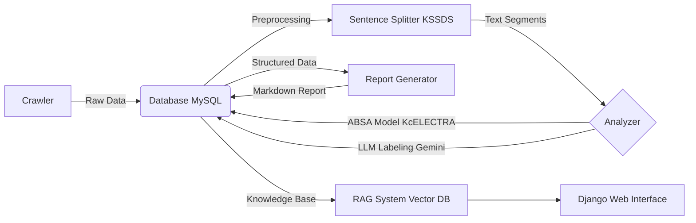

# Project KIWI: Intelligent App Review Analysis & RAG System

**Project KIWI**는 앱 스토어(Google Play, App Store)의 리뷰 데이터를 수집하고, **Deep Learning(ABSA)** 및 **LLM(RAG)** 기술을 활용하여 사용자 반응을 심층 분석하는 통합 플랫폼입니다.

수집된 데이터는 문장 단위로 분리되어 감성 및 속성(Aspect)을 분석하며, 분석된 결과는 LLM을 통해 인사이트 리포트로 생성됩니다. 사용자는 웹 인터페이스(Django)를 통해 리포트를 확인하거나, 챗봇에게 자연어로 질의하여 분석 결과에 기반한 답변을 얻을 수 있습니다.

---

## 🔄 System Architecture (Workflow)



## ✨ Key Features

1.  **Automated Crawling**: Google Play & App Store 리뷰 자동 수집.
2.  **Advanced Preprocessing**: `KSSDS` 및 `soynlp`를 활용한 한국어 구어체 문장 분리 및 정규화.
3.  **ABSA (Aspect-Based Sentiment Analysis)**: `KcELECTRA` 기반 딥러닝 모델로 리뷰의 특정 속성(디자인, 성능 등)과 감정(긍정/부정) 동시 분석.
4.  **AI Insight Report**: Google Gemini를 활용한 버전별/장르별 자동 분석 리포트 생성.
5.  **Interactive RAG Chatbot**: `LangChain`, `Groq`, `ChromaDB`를 연동하여 리뷰 데이터를 기반으로 답변하는 챗봇 구축.
6.  **Web Dashboard**: Django 기반의 시각화 및 리포트 뷰어.

---

## 🛠️ Environment Setup

### 1. Prerequisites
*   **Python**: 3.10 (권장) 또는 3.11
*   **Database**: MySQL (MariaDB)
*   **Java (JDK)**: KoNLPy 실행을 위해 필요
*   **API Keys**: Google Gemini API, Groq API, OpenAI API (Optional)

### 2. Unified Installation
프로젝트의 모든 모듈(크롤링, 분석, 웹, RAG)을 실행하기 위한 통합 라이브러리 설치 명령어입니다.

```bash
# 가상환경 생성 권장
conda create -n kiwi_env python=3.10
conda activate kiwi_env

# 1. Crawling
pip install pandas pymysql python-dotenv cryptography tqdm

# 2. front(Django)
pip install django daphne markdown pdfkit

# 3. NLP & Preprocessing (KSSDS)
pip install KSSDS soynlp
pip uninstall transformers -y
pip install transformers==4.30.2  # KSSDS 호환성 유지

# 4. fine_tuning (Torch/HuggingFace)
pip install torch --index-url https://download.pytorch.org/whl/cu121
pip install -U accelerate scikit-learn

# 5. report_creater & rag
pip install langchain chromadb google-generativeai google-play-scraper
pip install sentence-transformers
pip install groq
```
*(참고: Windows 사용자의 경우 `pdfkit` 사용을 위해 [wkhtmltopdf](https://wkhtmltopdf.org/downloads.html) 별도 설치가 필요합니다.)*

---

## ⚙️ Configuration

### 1. Database Schema
MySQL에 접속하여 `kiwi` 데이터베이스 및 테이블을 생성해야 합니다.
(상세 SQL 스크립트는 `crawling/README.md`를 참조하세요.)

### 2. Environment Variables (.env)
프로젝트 루트 디렉토리에 `.env` 파일을 생성하고 아래 정보를 입력하세요.

```ini
host=127.0.0.1
port=3306
user=사용자명
passwd=비밀번호
dbname=데이터베이스명

# API Keys
GEMINI_API_KEY=your_gemini_key
GROQ_API_KEY=your_groq_key
OPENAI_API_KEY=your_openai_key  # (선택 사항)
```

---

## 📂 Project Structure

| Module | Directory | Description |
|---|---|---|
| **Crawling** | `/crawling` | Google Play(`google-play-scraper`) 및 `/app_store_cralwer` iOS 리뷰 수집 스크립트 |
| **Preprocessing** | `/splitter` | 수집된 리뷰를 `KSSDS`를 이용해 문장 단위로 분리 및 DB 저장 |
| **ABSA Model** | `/fine_tuning` | `KcELECTRA` 기반 감성/속성 분류 모델 학습(`train`) 및 추론(`predict`) |
| **Analysis** | `/report_creater` | Gemini를 이용한 리포트 생성 및 데이터 가공 (`main.py`) |
| **RAG System** | `/rag` | 리포트 데이터 벡터화(`ingest_db.py`) 및 챗봇 엔진 구현 |
| **Frontend** | `/front` | Django 웹 서버, 리포트 뷰어 및 챗봇 UI 제공 |

---

## 🚀 Quick Start Guide

전체 파이프라인을 순서대로 실행하는 방법입니다.

### Step 1. 데이터 수집 (Crawling)
```bash
# App Store 리뷰 수집 및 DB 적재 (훈련 데이터)
python app_store_cralwer/app_store_crawler.py
# google-play store 리뷰 수집 및 DB 적재 (실제 데이터)
python crawling/crawler.py
```

### Step 2. 전처리 (Splitting)
```bash
# 수집된 리뷰를 문장 단위로 분리하여 review_line 테이블에 저장
python splitter/kssds_line_splitter.py
```

### Step 3. 분석 수행 (ABSA / Labeling)
```bash
# 훈련 데이터 라벨링
python fine_tuning/labeling.py
# 딥러닝 모델 또는 LLM을 사용하여 문장별 속성/감성 분석
python fine_tuning/predict2.py 
```

### Step 4. 리포트 생성 (Report Gen)
```bash
# 분석 데이터를 종합하여 마크다운 리포트 생성 및 DB 저장
python report_creater/main.py
```

### Step 5. RAG 데이터 적재
```bash
# 생성된 리포트를 벡터 DB(Chroma)에 임베딩하여 검색 가능하게 처리
python rag/ingest_db.py
```

### Step 6. 웹 서버 실행
```bash
# Django 서버 실행 (http://127.0.0.1:8000)
cd mysite
python manage.py runserver
```